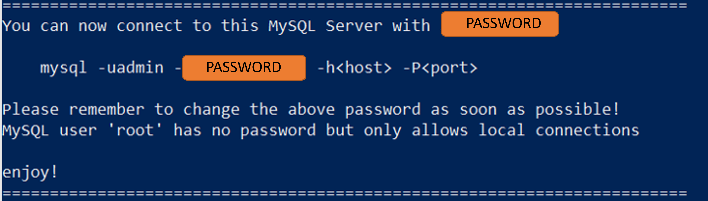

# DistantWhinnying
<h1>HORSE FARM DATABASE</h1>
<h2>CSCI 5560 Group Project - Fall 2022</h2>
<h3>Matthew Swindall & John Ford</h3>
  

Utilization of this database system requires the installation of Docker on your machine. For information regarding the installation and 
utilization of Docker, please visit <a href="https://www.docker.com/">https://www.docker.com/</a>. Once Docker is installed, you can initialize the docker environment using the command found in run.sh, changing the two directory paths to the location of this repository on your machine. You can then run the command in your terminal (for Linux and Mac) or in Powershell (for Windows).
  
Once the environment is initialized you will see a newly generated root password in terminal or Powershell as shown below. Copy the password
and add it to the second line of the file "config.inc.example". Then change this file name to "config.inc". This completes
the configuration of the database.

 
 

 
 

You may now access the database landing page in your machine's browser by navigating to "localhost:80". The database will be 
empty with no data or tables. Clicking on the "Create Database" button will create all required tables and data entry can begin.
 
It is important to note the heirarchy of data entries. New entries can only be added for a table if relations exist in tables with 
a lower heirarchy value.
 
 
<ol>
	<li>Pastures & Customers</li>
	<li>Horses & Riders</li>
</ol>
 
For example: A customer horse record can not exist if the associated customer record does not exist. Also, A horse record 
can not exist if a pasture record does not exist. The reverse is true for deletions: A customer can not be deleted if an associated 
horse or rider record exists. Additionally, the database can not be destroyed (via the "Destroy Database" button) if records exist
in the database. 
	

